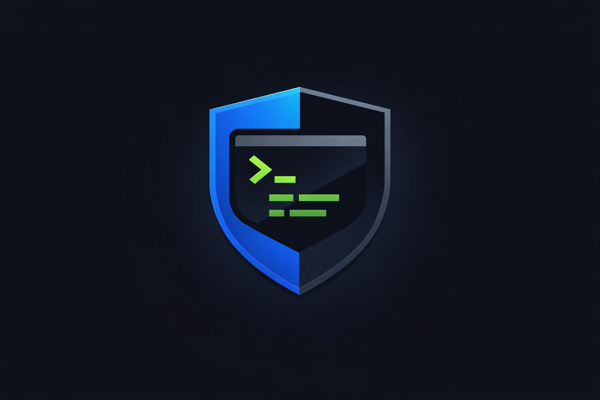

MiniQuantDeskV4

  
 
 <strong>Deterministic, Risk-First Execution and Capital Allocation Framework</strong>  Rust Core • Explicit Lifecycle • Engine Isolation • Scenario-Tested 
 
     

Overview

MiniQuantDeskV4 is a structured quantitative trading system built around one principle:

Capital protection is a systems problem.

This repository is not a signal library or strategy toy.
It is an execution spine designed to enforce discipline and mechanical safety boundaries.

Built for:

Retail traders who want institutional structure

Developers building serious trading infrastructure

Systematic traders who care about deterministic behavior

Internal tooling stacks that require explicit invariants

The system is engineered under adversarial assumptions:

Market data can be stale or incomplete

Brokers can drift or return inconsistent state

Orders can partially fill

Systems can restart mid-execution

Humans can misconfigure workflows

Safety is enforced architecturally — not socially.

Architecture

  

High-level flow:

Market Data / Research Artifacts
↓
Market Data Ingest + Quality Gates
↓
Deterministic Backtest Engine
↓
Integrity + Risk Gates
↓
Execution Boundary
↓
Lifecycle + DB Enforcement
↓
Control Plane (CLI / Daemon / GUI)

Core properties:

Deterministic event replay

Worst-case ambiguity modeling

Database-enforced lifecycle constraints

Engine-level capital isolation

Reconciliation gating before LIVE arming

Core Characteristics
Property	Description
Deterministic	Event-sourced backtesting and replay
Risk-First	Allocation limits enforced at execution boundary
Lifecycle Controlled	CREATED → ARMED → RUNNING → STOPPED
Execution Invariants	OMS state machine enforces order lifecycle correctness
Engine-Isolated	Capital segregation per engine
DB-Enforced Safety	LIVE exclusivity + lifecycle constraints
Scenario-Tested	Adversarial cases (partials, late fills, restart replay, drift, etc.)
Execution Safety Model

MiniQuantDeskV4 enforces execution safety through layered boundaries.

Intent
↓
Outbox (durable intent queue)
↓
Execution orchestrator
↓
Integrity + Risk gates
↓
Broker gateway choke-point
↓
Broker adapter normalization
↓
Durable inbox event ingestion
↓
OMS state machine
↓
Portfolio mutation

Safety invariants enforced by the execution layer:

No order lifecycle transition occurs outside the OMS state machine

Broker events are idempotently ingested through a durable inbox

Cancel/replace semantics preserve already-filled quantity

Broker identity mapping is maintained across restart

Late broker events cannot corrupt order state

Execution correctness is validated through adversarial scenario tests

Repository Structure
core-rs/
  crates/
    mqk-db
    mqk-md
    mqk-integrity
    mqk-risk
    mqk-execution
    mqk-broker-paper
    mqk-broker-alpaca
    mqk-backtest
    mqk-reconcile
    mqk-promotion
    mqk-isolation
    mqk-strategy
    mqk-audit
    mqk-testkit
    mqk-daemon

  mqk-gui/

research-py/

Rust forms the authoritative execution layer.
Python research emits deterministic artifacts consumed by the Rust spine.

What Works Today
Market Data

Canonical md_bars ingest

CSV + provider ingestion path

Data quality gate reporting

Gap detection + incomplete bar rejection

Backtesting

Deterministic event replay

Worst-case ambiguity modeling

Scenario-driven validation

Execution Engine

Explicit OMS order state machine

Broker adapter normalization layer

Deterministic outbox dispatch pipeline

Durable inbox event ingestion

Idempotent broker event handling

Cancel / replace correctness across partial fills

Internal ↔ broker order identity mapping

Risk & Integrity

Allocation / exposure caps

PDT helper module

Stale feed disarm

Feed disagreement halt logic

Deadman-style kill paths

Reconciliation

Snapshot normalization adapter

Drift detection

Reconcile-before-arm gating (configurable)

Control Plane

CLI workflows

HTTP daemon for lifecycle + status

GUI console with status streaming (SSE)

Reliability Hardening Status

This project is under structured reliability hardening.

Completed

Lifecycle enforcement

Engine isolation

Deterministic replay

Market data ingest + quality reporting

Control plane wiring

OMS state machine for order lifecycle

Idempotent broker event ingestion

Cancel / replace correctness after partial fills

Scenario coverage across subsystems

In Progress

Durable broker event cursor / restart resume

Broker error taxonomy + retry policy

Ambiguous submit quarantine

Live broker adapter completion

Leader lease / single-runtime enforcement

Periodic reconcile tick with hard halt capability

“Scenario-tested” does not imply production-live safety.

Execution Reliability Roadmap

Execution reliability work is organized into explicit hardening phases.

Current focus areas:

Durable broker event cursor and restart-safe event replay

Broker error taxonomy with explicit retry behavior

Ambiguous submit quarantine and operator release workflow

Live broker adapter completion with contract testing

Single-runtime enforcement via database-backed leader lease

Adversarial execution scenario expansion

The goal is to ensure that restart, network disruption, broker inconsistency,
and event ordering anomalies cannot corrupt order lifecycle state.

Reliability hardening is prioritized over feature expansion.

Security Model

MiniQuantDeskV4 assumes:

The local environment may be misconfigured

External data feeds are untrusted

Broker APIs may return inconsistent or delayed state

Restarts may occur at unsafe boundaries

Security and safety are enforced through:

Deterministic execution paths (no hidden randomness)

Database-enforced lifecycle constraints

Explicit state transitions

Isolation between engines

Integrity + risk gates before execution

Reconciliation hooks before LIVE arming

This repository does not attempt to:

Provide hardened secret management

Implement network-level security controls

Protect against host-level compromise

Guarantee broker API correctness

Operational security is the responsibility of the deployment environment.

System Guarantees & Non-Guarantees
What the System Guarantees (Within Scope)

Deterministic backtest replay given identical inputs

Explicit lifecycle state enforcement

Single LIVE run per engine (database constrained)

Capital allocation caps enforced at execution boundary

Idempotent broker event ingestion

Correct order lifecycle transitions through OMS state machine

Scenario-driven validation of adversarial cases

What the System Does NOT Guarantee

Profitability

Broker correctness

Protection from infrastructure misconfiguration

Immunity to exchange-level anomalies

Automatic capital preservation without proper configuration

This framework reduces structural risk.
It does not eliminate market risk.

Quick Start

This is a systems project focused on reproducibility and safety invariants.

1. Clone
git clone <your-repo-url>
cd MiniQuantDeskV4
2. Requirements

Rust (stable toolchain)

Docker (recommended for Postgres)

3. Start Postgres (Example)
docker run --name mqk-postgres \
  -e POSTGRES_USER=mqk_user \
  -e POSTGRES_PASSWORD=mqk_pass \
  -e POSTGRES_DB=mqk \
  -p 5432:5432 \
  -d postgres:16
4. Build + Test
cd core-rs
cargo fmt
cargo clippy --workspace --all-targets -- -D warnings
cargo test --workspace

All tests should pass before modifying behavior.

5. Optional: Control Plane

Daemon exposes lifecycle + status endpoints

GUI provides control console over daemon

See README_TECHNICAL.md for exact commands and configuration.

Design Philosophy

Returns are a strategy problem.
Blow-ups are a systems problem.

MiniQuantDeskV4 is engineered to address the second.

Disclaimer

This repository is an engineering framework for systematic capital allocation research.

It is not financial advice.

Do not deploy real capital without independent operational review, monitoring infrastructure, and governance controls.