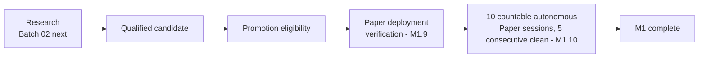
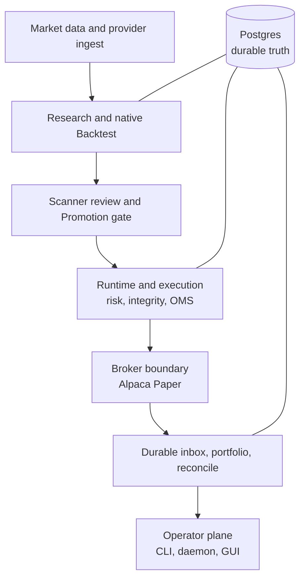

  

<h1 align="center">MiniQuantDeskV4 — Veritas Ledger</h1>

  <strong>Deterministic, fail-closed, auditable quantitative research and trading platform</strong> 
  Rust core • Python research • Postgres-backed truth • daemon + operator GUI

  
  
  
  

> **Naming.** *Veritas Ledger* is the project's name and presentation layer; *MiniQuantDeskV4* is the same
> repository, workspace and codebase (crate prefix `mqk-`). They are one project, not two.

## Overview

MiniQuantDeskV4 is a deterministic, risk-first platform for researching, validating and (eventually) operating
systematic trading strategies. Its premise: **capital protection is a systems problem.**

It is not a signal toy and not a broker-click wrapper. The design assumes that market data can be stale or
inconsistent, broker events can drift, duplicate or arrive out of order, processes can restart mid-order, and
humans can misconfigure the control plane — so safety is enforced by the architecture:

- explicit run and order lifecycles, with durable outbox/inbox truth in Postgres
- fail-closed behavior whenever authoritative truth is missing
- causal, cost-aware backtesting with content-addressed strategy, data, benchmark and sizing identity
- statistical research governance: trials are registered before results, promotion needs bound evidence, and the final holdout stays reserved
- operator surfaces (CLI, daemon, GUI) that distinguish *unavailable* from *empty* from *present*

## Current project status

The current top-level target is **Milestone 1 (M1) — US Equity/ETF Paper Production**. The project is in **M1
candidate discovery**: the engineering for research, backtesting, promotion evaluation and the Paper path is
largely in place, but **no strategy has yet qualified for promotion, so no strategy is deployed to Paper**.
The accepted baseline is `origin/main` at `92d337b6`, with Native Sizing V1 pushed and verified in CI.
Live trading is disabled and not ready.

| Topic | Current state |
|---|---|
| Current milestone | **M1 — US Equity/ETF Paper Production** (open) |
| Accepted baseline | `origin/main` `92d337b67670b2858aa24c00b2768a2ca04cc212` |
| Research / backtest stack | Native strategy engines, causal Backtest, scanner/review (Benchmark V2), Promotion gate, statistical judge |
| Native Sizing V1 (`fixed_initial_capital_fraction_v1`) | **PUSHED-VERIFIED** — GitHub CI #621 (run 37145565796), SUCCESS, 6/6 jobs, on the exact pushed head |
| Research Batch 01 | **BATCH_REJECTED** (no `paper_candidate`) |
| Research Batch 02 | **NOT STARTED — next** (no hypotheses run, no results) |
| Promotion | **None** — no strategy is selected or promoted |
| Paper deployment | **Inactive** — no active deployed Paper strategy; pending a valid promotable candidate |
| Final holdout | **RESERVED / UNCONSUMED** |
| Live | **DISABLED / NOT READY** |

Historical evidence remains accepted: a genuine Paper trade lifecycle and a genuine Paper no-trade lifecycle
were each observed end to end. That evidence does not mean a strategy is currently deployed.

Milestones M2–M10 (multi-strategy, concurrent Paper/Live, Live, other asset classes, full autonomy, release
freeze) are future milestones. Some contain meaningful code or foundation work, but none is claimed operationally
complete and none is the current target.

## What the repo does today

- **Research** — Python research layer plus native Rust strategy engines; hypotheses and trials are registered before results; overfitting controls (e.g. DSR, PBO) gate candidates.
- **Backtesting** — deterministic, causal, cost- and execution-aware replay; no same-bar fills; explicit sizing policy and benchmark identity.
- **Promotion evaluation** — a candidate needs bound evidence (strategy, data, benchmark, sizing identity) before it can be promoted; missing or mismatched evidence fails closed.
- **Daemon / runtime** — Rust execution spine: outbox → broker submit → broker truth → inbox → portfolio/accounting, with OMS state machine, risk and integrity gates, halt and reconcile.
- **Paper control plane** — Alpaca Paper path with daily-operation lifecycle, readiness/preflight gating and evidence capture. It is built and has historical lifecycle evidence, but is currently not running any strategy.
- **GUI / operator surfaces** — Vite/React console and HTTP daemon with explicit `truth_state` on data-bearing responses.
- **DB-backed safety and CI** — Postgres durable state, append-only migrations, repo guards, and a six-job GitHub CI pipeline.

## Current M1 finish path

```mermaid
flowchart LR
  A[Research<br/>Batch 02 next] --> B[Qualified candidate]
  B --> C[Promotion eligibility]
  C --> D[Paper deployment<br/>verification - M1.9]
  D --> E[10 countable autonomous<br/>Paper sessions, 5 consecutive clean - M1.10]
  E --> F[M1 complete]
```

Text form: Research → candidate → Promotion eligibility → Paper deployment verification → 10 countable sessions
with 5 consecutive clean → M1 complete.

Where we are on that path: Batch 01 was rejected, Batch 02 is next, and **every step after Research is still
open**. In particular:

- candidate discovery and the promotion path are open — there is no candidate yet;
- M1.9, verification of the actual deployed Paper state, is open;
- M1.10, ten countable autonomous Paper sessions including five consecutive clean ones, is open.

Batch 02 is a frozen research direction, not a result. Its hypotheses are turn-of-month, Halloween (November–April),
and a 50-day trading-range breakout with a 10-day hold. None of them has been run.

## Architecture at a glance

```mermaid
flowchart TB
  D[Market data and provider ingest] --> R[Research and native Backtest]
  R --> P[Scanner review and Promotion gate]
  P --> X[Runtime and execution<br/>risk, integrity, OMS]
  X --> B[Broker boundary<br/>Alpaca Paper]
  B --> I[Durable inbox, portfolio, reconcile]
  DB[(Postgres<br/>durable truth)] --- R
  DB --- X
  DB --- I
  I --> O[Operator plane<br/>CLI, daemon, GUI]
```

- **Rust (`core-rs/`)** is the authoritative execution and control layer; **Python (`research-py/`)** is research only and has no execution authority.
- **Postgres** is the durable source of truth after any restart; in-memory state never outranks it.
- **Broker events are never synthesized.** Fills, acknowledgements and cancellations come only from broker truth.
- `MAIN` is the canonical engine; `EXP` is experimental and is not operational truth unless explicitly promoted.

Deeper detail, including how strategy, data, benchmark and sizing identity bind, is in [README_TECHNICAL.md](README_TECHNICAL.md).

## Repository map

| Path | Purpose |
|---|---|
| `core-rs/crates/` | Rust workspace: `mqk-db`, `mqk-runtime`, `mqk-execution`, `mqk-portfolio`, `mqk-risk`, `mqk-integrity`, `mqk-reconcile`, `mqk-strategy`, `mqk-backtest`, `mqk-promotion`, `mqk-md`, `mqk-daemon`, `mqk-cli`, broker adapters (`mqk-broker-paper`, `mqk-broker-alpaca`, `mqk-broker-ibkr`), and supporting crates |
| `core-rs/mqk-gui/` | Vite/React operator console |
| `research-py/` | Python research layer |
| `config/` | Layered config sets |
| `scripts/` | Guards, proof, Windows launch and evidence helpers |
| `docs/` | Specs, runbooks, research records, current mission |
| `.claude/`, `CLAUDE.md` | Operating contract and rules for AI-assisted work in this repo |

## Authoritative docs

This README is a summary, not a ledger. Detailed and current status lives in:

- [`MiniQuantDeskV4_Master_Program_Plan_and_Ledger.md`](MiniQuantDeskV4_Master_Program_Plan_and_Ledger.md) — frozen milestone roadmap and program ledger
- [`docs/CURRENT_MISSION.md`](docs/CURRENT_MISSION.md) — current durable project state
- [`README_TECHNICAL.md`](README_TECHNICAL.md) — technical orientation, setup, proof and operating commands
- [`docs/research/NATIVE_SIZING_V1_CONTRACT.md`](docs/research/NATIVE_SIZING_V1_CONTRACT.md) — sizing contract
- [`docs/research/Research_Backtest_V1_Closeout_Audit.md`](docs/research/Research_Backtest_V1_Closeout_Audit.md) — Research/Backtest closeout audit
- [`docs/runbooks/`](docs/runbooks/) — operator runbooks (e.g. `autonomous_paper_ops.md`)

If this README and those documents disagree, the documents and the committed code and tests win.

## Safety boundary

- **Holdout** — the final holdout is reserved and unconsumed; consumed holdout data is never fresh again.
- **Paper** — inactive; no strategy is deployed. Paper activation needs a qualified, promoted candidate and its own authorized mission.
- **Live** — disabled and not ready. Typed support for Live modes exists in code; that is not an operational or safety claim.
- **Not promised** — profitability, broker or exchange correctness, host-level security, or safe unattended live trading.

## Secrets and disclaimer

Never put a real `.env.local`, API keys, operator tokens, webhooks or broker secrets in repo snapshots, support
bundles or AI handoffs; `.env.local.example` contains placeholders only. If real credentials were ever shared,
rotate them before running broker-connected sessions.

This repository is an engineering framework for systematic research and operator-controlled execution. It is not
investment advice and makes no promise of profitability or safe unattended live trading.
